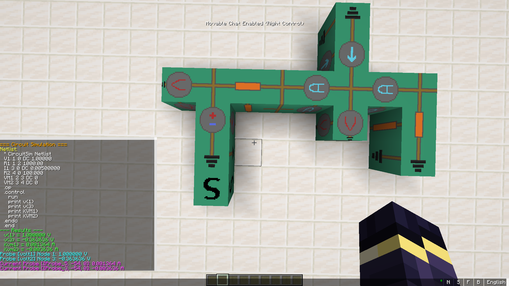

# CircuitSim — A Minecraft Circuit Simulation Mod
 



> **This mod was built entirely with AI assistance.**
 
CircuitSim is a Minecraft Forge mod for version **1.20.1** that lets you build and simulate real electronic circuits inside the game. Place component blocks in the world, connect them with wires, and right-click the **Simulate Block** to run a full SPICE simulation powered by [ngspice](https://ngspice.sourceforge.io/).
 
---
 
## Features
 
- **Component blocks:** Resistor, Capacitor, Inductor, Voltage Source, Current Source, Diode, Wire, Ground
- **Measurement blocks:** Voltage Probe, Current Probe
- **SPICE simulation** via ngspice running as a subprocess — real node voltages and branch currents
- **In-game GUI** to configure component values (resistance, capacitance, voltage, etc.)
- **AC support** for voltage sources (SINE waveform)
- Results printed directly to the in-game chat
---
 
## Requirements
 
- Minecraft **1.20.1**
- Minecraft Forge **47.3.0**
- Java **17**
- [ngspice](https://ngspice.sourceforge.io/) installed and available on your system `PATH`
---
 
## Installation
### Method 1: Just take it
1. Install **Java 17** and **Minecraft Forge 47.3.0** for Minecraft 1.20.1.
2. Install [ngspice](https://ngspice.sourceforge.io/) and make sure `ngspice_con` (Windows) or `ngspice` (Linux/Mac) is accessible from your terminal.
3. Grab the [Latest Release](../../releases/latest)
4. Transfer the mod from `mod/circuitsim-x.x.x` into your Minecraft `mods/` folder 


### Method 2: Build it yourself
1. Install **Java 17** and **Minecraft Forge 47.3.0** for Minecraft 1.20.1.
2. Install [ngspice](https://ngspice.sourceforge.io/) and make sure `ngspice_con` (Windows) or `ngspice` (Linux/Mac) is accessible from your terminal.
3. Clone this repository:
   ```bash
   git clone https://github.com/Dank0v/circuitsim.git
   cd circuitsim
   ```
4. Build the mod using the Gradle wrapper:
   ```bash
   # Windows
   gradlew.bat build
 
   # Linux / Mac
   ./gradlew build
   ```
5. Find the compiled `.jar` in `build/libs/` — it will be named something like `circuitsim-1.0.0.jar`.
6. Drop that `.jar` into your Minecraft `mods/` folder.
7. Launch the game.
---
 
## How to Use
 
1. Open the **Circuit Simulator** creative tab to find all blocks.
2. Place component blocks and connect them with **Wire** blocks. Every circuit needs at least one **Ground** block.
3. Right-click any component to open its configuration GUI and set its value.
4. Place a **Simulate Block** anywhere connected to the circuit.
5. Right-click the **Simulate Block** to run the simulation. Results appear in chat.
### Probes
 
- **Voltage Probe** — place adjacent to a wire node. Right-click to give it a label. The simulation will report the voltage at that node.
- **Current Probe** — place in series (between two wires) to measure current through that branch.
---
 
## Known Issues / TODO
 
- **No Probe = Full Chat** — when simulating without any probe ngspice dumbs a lot of info in the chat.
- **Only .OP, .AC Simulation** — add .DC, .TRAN, in the future
 
---
 
## License
 
GPL-3.0 — see [LICENSE](LICENSE).
